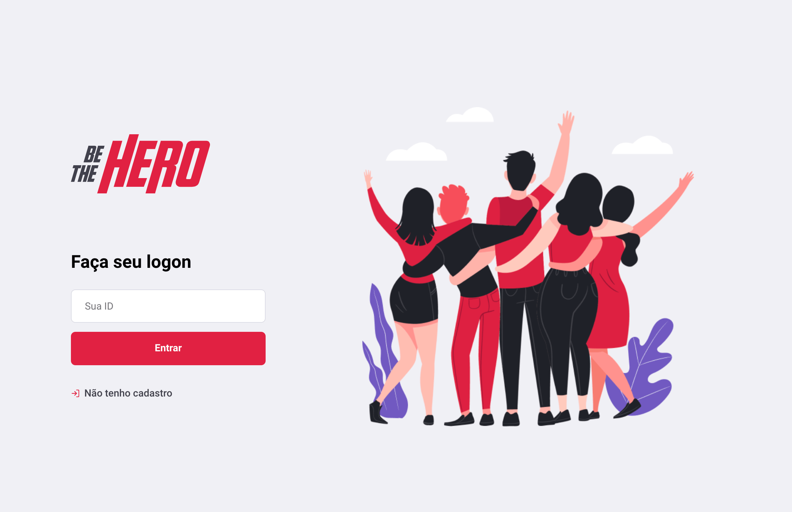

<h1 align="center">
    
</h1>

  <a href="#tecnologias">Tecnologias</a>&nbsp;&nbsp;&nbsp;|&nbsp;&nbsp;&nbsp;
  <a href="#projeto">Projeto</a>&nbsp;&nbsp;&nbsp;|&nbsp;&nbsp;&nbsp;
  <a href="#layout">Layout</a>&nbsp;&nbsp;&nbsp;|&nbsp;&nbsp;&nbsp;
  <a href="#licença">Licença</a>

## Tecnologias

Esse projeto Backend, foi desenvolvido com as seguintes tecnologias:

- [Node.js](https://nodejs.org/en/) 
- [React](https://reactjs.org)
- [React Native](https://facebook.github.io/react-native/) in coming :construction:
- [Expo](https://expo.io/) in coming :construction:

## Projeto

O Be The Hero é um projeto que visa conectar pessoas a ONGs e visualizar seus CASOS de forma simples e direta.

## Layout

:construction: In progress.. :construction:

## Licença

Esse projeto está sob a licença MIT. Veja o arquivo [LICENSE](LICENSE.md) para mais detalhes.

---

[Bruno Castro](http://www.brunocastro.dev) - [bruno@bhzautomacao.com.br](mailto:bruno@bhzautomacao.com.br) - Development
