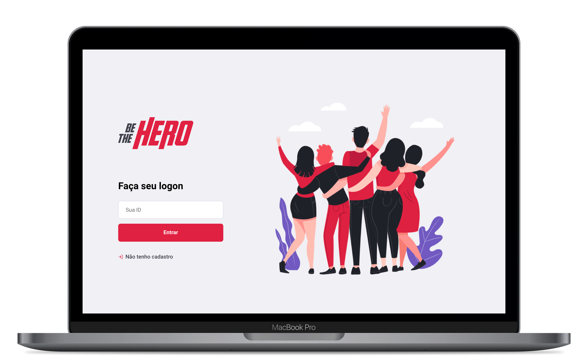
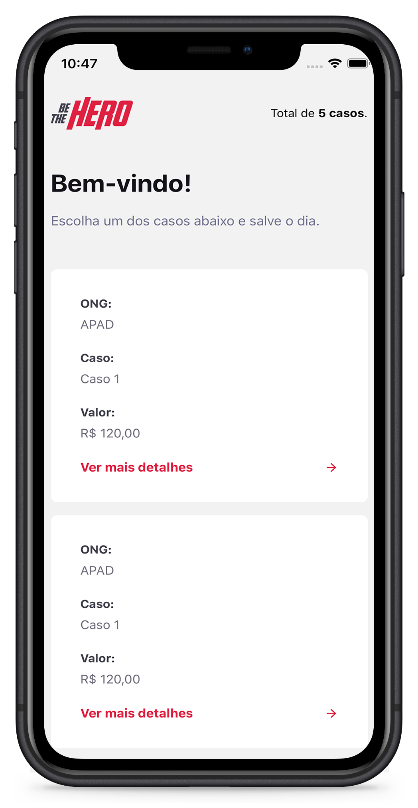
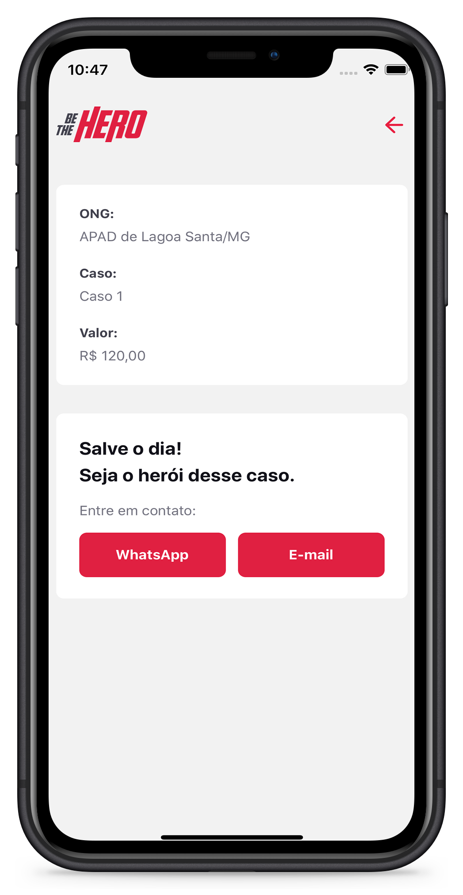

    

  <a href="#projeto">Projeto</a>&nbsp;&nbsp;&nbsp;|&nbsp;&nbsp;&nbsp;
  <a href="#tecnologias">Tecnologias</a>&nbsp;&nbsp;&nbsp;|&nbsp;&nbsp;&nbsp;
  <a href="#setup">Setup</a>&nbsp;&nbsp;&nbsp;|&nbsp;&nbsp;&nbsp;
  <a href="#layout">Layout</a>&nbsp;&nbsp;&nbsp;|&nbsp;&nbsp;&nbsp;
  <a href="#licença">Licença</a>

## Projeto

O Be The Hero é um projeto que visa conectar pessoas a ONGs e visualizar seus CASOS de forma simples e direta.

Na plataforma Web as Ongs realizam seus cadastros e postam seus casos, ja na plataforma mobile todos os usuários tem acesso aos casos e escolhem quais desejam ajudar.

Aprimorando o backend com testes em #Jest com auxilio do #Supertest. E usando o #Celebrate para realizar validações dos dados enviados.

## Tecnologias

Esse projeto Backend, foi desenvolvido com as seguintes tecnologias:

- [JavaScript](https://developer.mozilla.org/pt-BR/docs/Web/JavaScript)
- [HTML](https://developer.mozilla.org/pt-BR/docs/Web/HTML)
- [CSS](https://developer.mozilla.org/pt-BR/docs/Web/CSS)
- [Node.js](https://nodejs.org/en/) 
- [React](https://reactjs.org)
- [React Native](https://facebook.github.io/react-native/) 
- [Expo](https://expo.io/)
- [SQLite](https://www.sqlite.org/index.html)

- ### Backend 
	* **celebrate**:  ^12.0.1
	* **cors**:  ^2.8.5
	* **cross-env**:  ^7.0.2
	* **dotenv**:  ^8.2.0
	* **express**:  ^4.17.1
	* **knex**:  ^0.20.13
	* **nodemailer**:  ^6.4.6
	* **nodemailer-express-handlebars**:  ^4.0.0
	* **nodemon**: ^2.0.2 
	* **sqlite3**:  ^4.1.1

- ### Web
	* **@testing-library/jest-dom**:  ^4.2.4
	* **@testing-library/react**:  ^9.3.2
	* **@testing-library/user-event**:  ^7.1.2
	* **axios**:  ^0.19.2
	* **polished**:  ^3.5.1
	* **react**:  ^16.13.1
	* **react-dom**:  ^16.13.1
	* **react-icons**:  ^3.9.0
	* **react-router-dom**:  ^5.1.2
	* **react-scripts**:  3.4.1",
	* **react-toastify**:  ^5.5.0
	* **styled-components**:  ^5.0.1

- ### Mobile
	- #### React navigation
		* **@react-native-community/masked-view**: 0.1.5
		* **@react-navigation/drawer**:  ^5.3.4
		* **@react-navigation/native**:  ^5.1.3
		* **@react-navigation/stack**:  ^5.2.6
	* **axio**s:  ^0.19.2
	* **expo**:  ~36.0.0
	* **expo-constants**:  ~8.0.0
	* **expo-mail-composer**:  ~8.0.0
	* **intl**:  ^1.2.5
	- #### React
		* **react**:  ~16.9.0
		* **react-dom**:  ~16.9.0
		* **react-native**:  https://github.com/expo/react-native/archive/sdk-36.0.0.tar.gz
		* **react-native-gesture-handler**:  ~1.5.0
		* **react-native-reanimated**:  ~1.4.0
		* **react-native-safe-area-contex**:  0.6.0
		* **react-native-screens**:  2.0.0-alpha.12
		* **react-native-web**:  ~0.11.7
	* **styled-components**:  ^5.0.1

## Setup

Clone o repositório em sua maquina:

` git clone https://github.com/JuniorTrojilio/be-the-hero.git`

- Abra as pastas **backend, frontend, mobile** e execute `npm install` para instalar todas as dependencies
- Abra as pastas **backend, frontend, mobile** e execute `npm start` para iniciar o servidor

## Layout

    

    
		

## Licença

Esse projeto está sob a licença MIT. Veja o arquivo [LICENSE](LICENSE.md) para mais detalhes.

---

[Bruno Castro](http://www.brunocastro.dev) - [bruno@bhzautomacao.com.br](mailto:bruno@bhzautomacao.com.br) - Development
